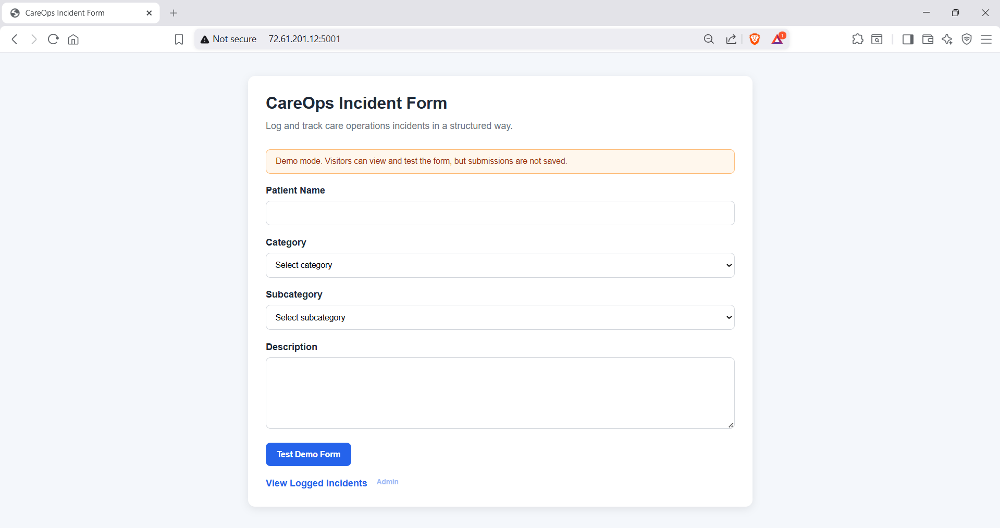
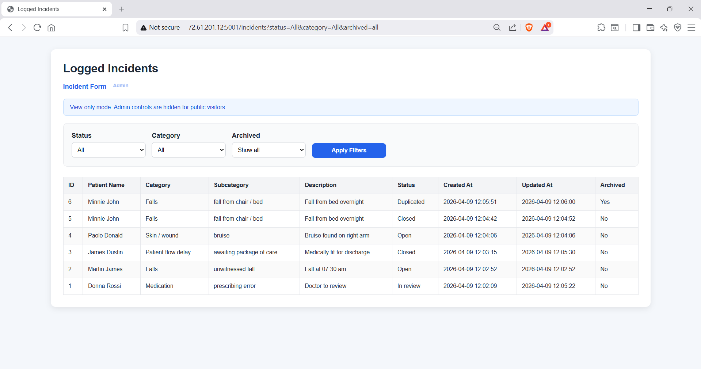
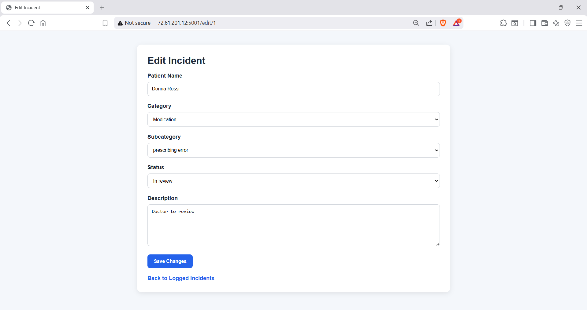
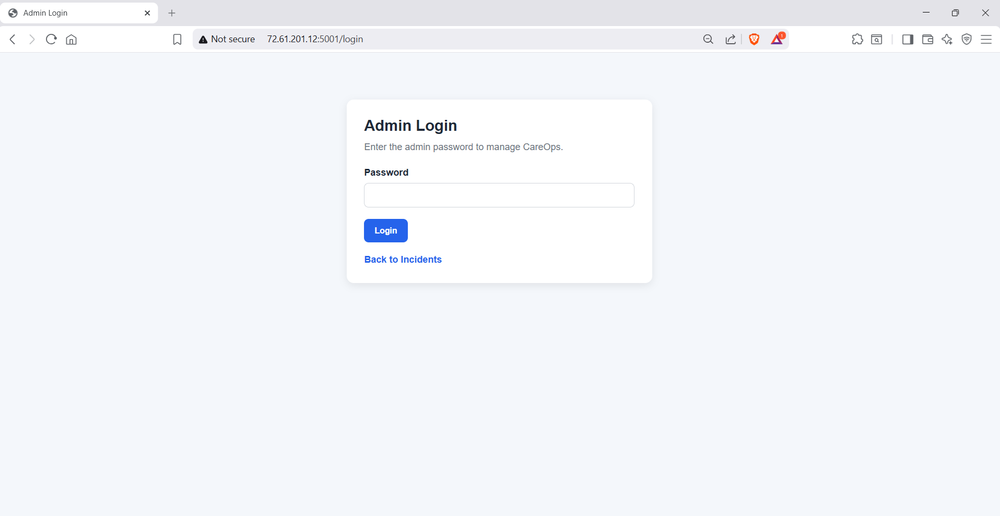
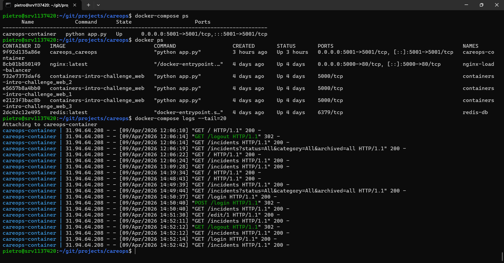

# CareOps

CareOps is a lightweight care operations and governance tracking system built to log, manage, and review incidents in a structured way.

It started as a practical incident logging app and is being developed further as a broader operational and governance platform for care settings.

## Project Overview

### Incident Form
Structured form to log care-related incidents with category and subcategory selection.



### Logged Incidents Dashboard
View, filter, and manage incidents with status tracking, timestamps, and archive functionality.



### Edit Incident
Update incident details including category, subcategory, status, and description.



### Admin Access
Secure admin login to control editing, archiving, and data management.



### Docker Deployment and Logs
Application fully containerised and running via Docker Compose, with container status and live request logs visible.



## Purpose

The aim of CareOps is to provide a simple but structured system to:

- log incidents consistently
- track incident status
- review trends and operational themes
- support better governance and oversight
- create a foundation for future dashboards, automation, and AI-supported reporting

This project is also part of my DevOps learning journey, where I am building real-world systems and deploying them properly using Docker, Nginx, and VPS-based infrastructure.

## Current Features

- Incident form with category and subcategory logic
- Public demo mode with form visibility but disabled public submission
- Admin login for protected actions
- Admin-only incident submission
- Edit incident function
- Archive and unarchive workflow
- Status tracking:
  - Open
  - In review
  - Closed
  - Duplicated
- Filtering by:
  - status
  - category
  - archived state
- Created and updated timestamps
- Cleaner UI for form, incident table, and edit pages

## Categories

### Medication
- missed dose
- wrong dose
- prescribing error
- delayed supply
- administration error

### Skin / wound
- skin tear
- pressure sore
- bruise
- wound deterioration

### Falls
- unwitnessed fall
- fall from chair / bed
- fall from height

### Patient flow delay
- awaiting package of care
- awaiting nursing bed
- awaiting off-island transfer
- awaiting social review

## Tech Stack

- Python
- Flask
- SQLite
- HTML / CSS / JavaScript
- Docker
- Docker Compose
- Nginx
- VPS deployment
- Environment variables via `.env`

## Deployment Setup

CareOps is containerised with Docker and can be run using Docker Compose.

Current deployment flow:

User → Nginx → Docker container → Flask application

Current access setup:
- direct app access on port `5001`
- Nginx reverse proxy access on port `8080`

## Security / Access Model

The project currently supports two modes:

### Public mode
- can view incidents
- can use filters
- can view and test the incident form
- cannot submit live incidents
- cannot edit or archive incidents

### Admin mode
- can submit incidents
- can edit incidents
- can archive and unarchive incidents
- can access protected management functions

Secrets are stored outside the codebase using environment variables.

## Run Locally

### 1. Create and activate virtual environment

```bash
python3 -m venv venv
source venv/bin/activate
```

### 2. Install dependencies

```bash
pip install -r requirements.txt
```

### 3. Create `.env`

```env
ADMIN_PASSWORD=yourpassword
SECRET_KEY=your_long_random_secret
```

### 4. Run the app

```bash
python app.py
```

## Run with Docker

### Build and run with Compose

```bash
docker-compose up -d --build
```

### Stop

```bash
docker-compose down
```

## Project Structure

```bash
careops/
├── app.py
├── Dockerfile
├── docker-compose.yml
├── requirements.txt
├── .gitignore
├── .dockerignore
├── templates/
│   ├── index.html
│   ├── incidents.html
│   ├── edit_incident.html
│   └── login.html
└── README.md
```

## Roadmap

Planned future improvements include:

- improved dashboard and summary views
- subcategory filtering
- better reporting and analytics
- production-ready domain and HTTPS setup
- CI/CD pipeline
- Terraform-based infrastructure
- AWS-hosted deployment options
- migration from SQLite to a more scalable database
- AI-supported summaries and governance insights
- broader care operations and compliance modules beyond incident tracking

## Why I Built This

I wanted to build a real project that combines:

- practical operational problems from healthcare
- governance and quality improvement thinking
- DevOps learning through real deployment work

CareOps reflects both sides of that journey:

- building something useful
- and learning how to package, deploy, and manage it properly
